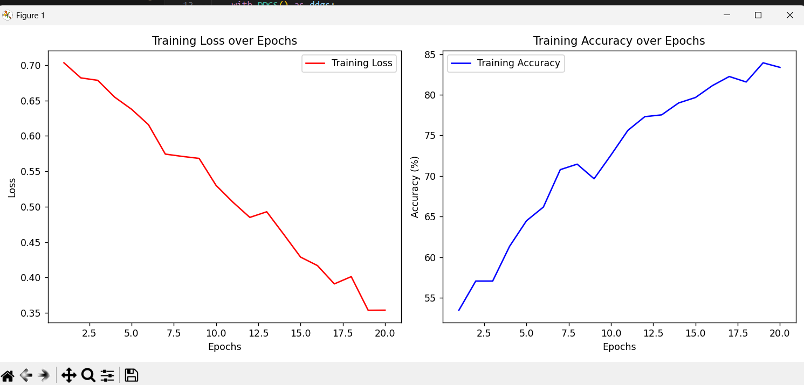
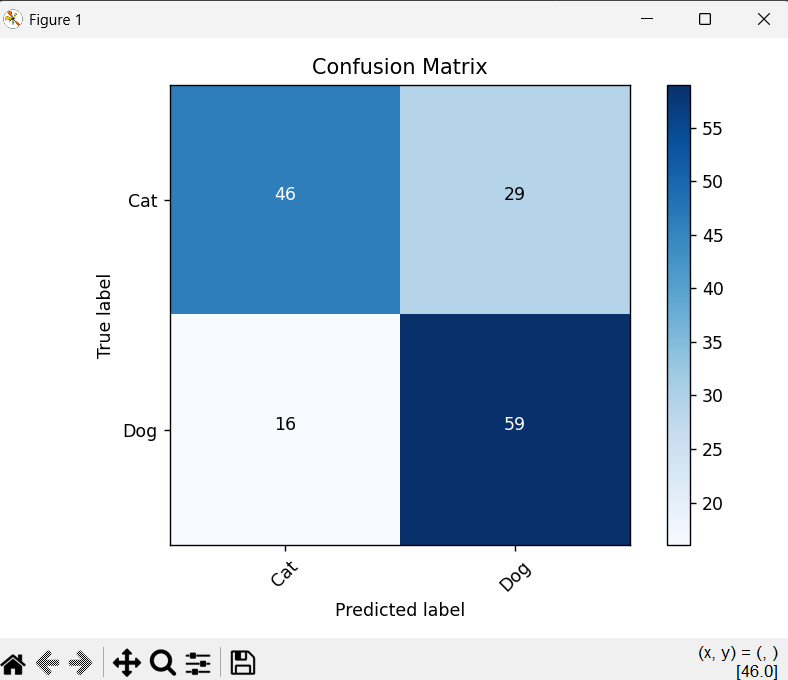
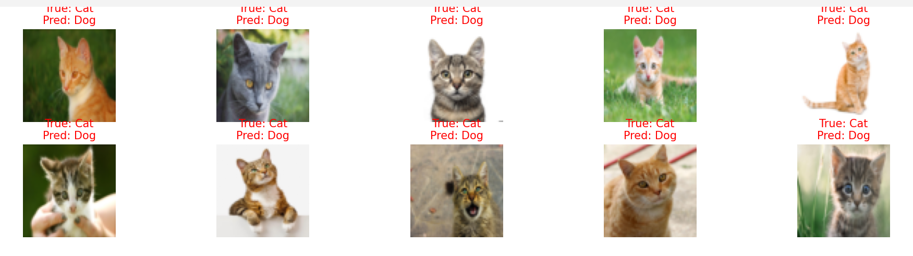
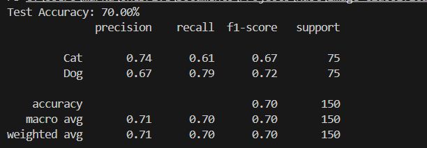

# Cat vs Dog Image Classification

---

## Installation

```bash
git clone git@github.com:varenst/Image-Classification.git
cd Image-Classification

pip install -r requirements.txt
```

---

## How it works

This project builds a **simple CNN** from scratch using **PyTorch** to classify images into two categories: **cats** and **dogs**.

- No pretrained models were used.
- Model architecture follows **PyTorch official tutorials**.
- Input images are resized to **64x64**.
- Basic data augmentation applied:
  - Random horizontal flip
  - Random rotation
- Model consists of:
  - 3 convolutional layers
  - 2 fully connected layers
  - Dropout regularization

### Workflow

```bash
# Train the model
python -m cnn --train

# Test the model
python -m cnn --test

# helper
python -m cnn --h
```

---

## Goals

The goals of the project were:

- Build a cNN with PyTorch.
- No transfer learning or pretrained models.
- Achieve at least 70% test accuracy. (so that it proves a point)
- make a custom dataset

## Accuracy and Additional Results

Final Test Accuracy: **70%**

---

### Training Curves



---

### Confusion Matrix



---

### Misclassified Examples



---

### More Data


